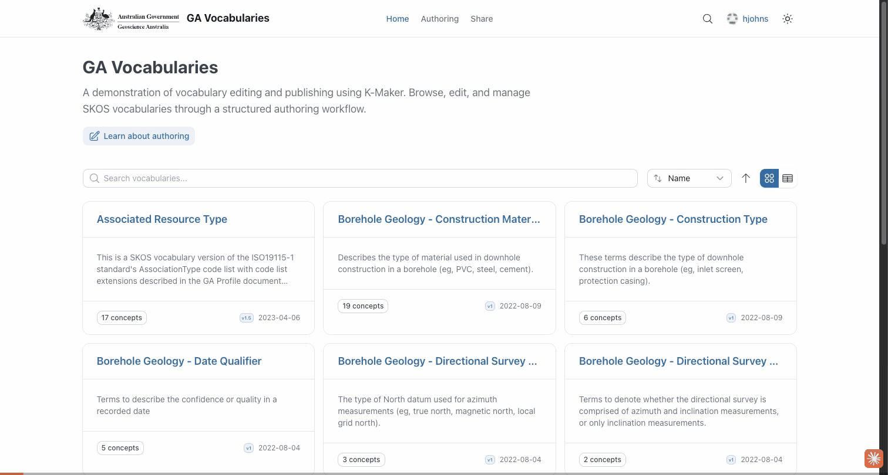

# Run 01 — Edit an existing concept

**Scenario:** an editor changes a property on an existing concept and submits it for review.
**Vocabulary:** Associated Resource Type · **Concept:** collectiveTitle

## What this verifies
A signed-in editor can open a published vocabulary, change a concept's value, save it, and submit it for approval through the standard authoring workflow.

## Steps
1. Open the **Associated Resource Type** vocabulary (edit mode).
2. Select the **collectiveTitle** concept.
3. Edit a property value (the alternative label).
4. **Save** → review the change summary → **Save to GitHub**.
5. **Submit for Approval**.

## Result
✅ The edit is saved and submitted for review — a review request is raised for an approver to publish.
