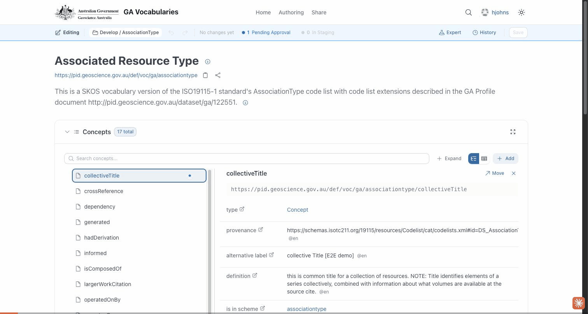

# Run 02 — Add a new concept to a vocabulary

**Scenario:** an editor adds a brand-new concept to an existing vocabulary and submits it for review.
**Vocabulary:** Associated Resource Type · **New concept:** E2E Demo Concept

## What this verifies
A signed-in editor can add a new concept to a published vocabulary, name it, save it, and submit it for approval.

## Steps
1. Open the **Associated Resource Type** vocabulary (edit mode).
2. **+ Add** a concept.
3. Set its **preferred label** ("E2E Demo Concept").
4. **Save** → review the change summary → **Save to GitHub**.
5. **Submit for Approval**.

## Result
✅ The new concept is saved and submitted for review.
