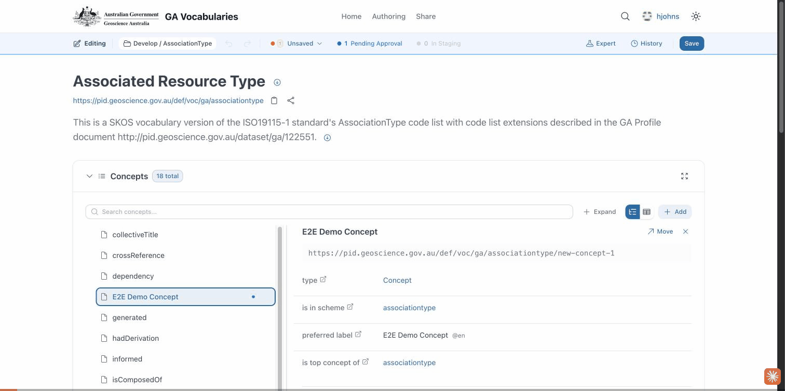

# Run 03 — Create a new vocabulary

**Scenario:** an editor creates a brand-new vocabulary, adds a concept to it, and submits it for review.
**New vocabulary:** E2E GIF Vocabulary · **Concept:** GIF Test Concept

## What this verifies
A signed-in editor can create a new vocabulary from scratch in the editor, add a concept, save, and submit it for approval.

## Steps
1. Open the workspace and choose **New vocabulary**.
2. Enter a title and description (the identifier and IRI are filled in automatically).
3. **Create vocabulary** — the new vocabulary opens in the editor.
4. **+ Add** a concept and set its **preferred label** ("GIF Test Concept").
5. **Save** → review the change summary → **Save to GitHub**.
6. **Submit for Approval**.

## Result
✅ The new vocabulary and its concept are saved and submitted for review.
